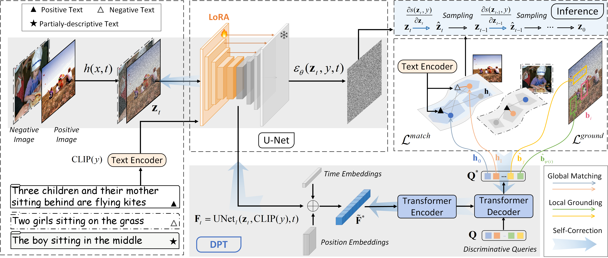

# DPT-T2I
<h3><a href="">Discriminative Probing and Tuning for Text-to-Image Generation</a></h3>

[Leigang Qu](https://lgqu.github.io/), [Wenjie Wang](https://wenjiewwj.github.io/), [Yongqi Li](https://liyongqi67.github.io/), [Hanwang Zhang](https://personal.ntu.edu.sg/hanwangzhang/), [Liqiang Nie](https://liqiangnie.github.io/), and [Tat-Seng Chua](https://www.chuatatseng.com/)

<a href='https://dpt-t2i.github.io/'></a>

<a href='https://arxiv.org/abs/2403.04321'></a>

This repository contains code and links to  the DPT model for text-to-image (T2I) generation to improve text-image alignment. We show the potential of discriminative abilities of pre-trained T2I models and significant gains on text-image alignment after discriminative tuning based on image-text matching (ITM) and referring expression comprehension (REC) tasks.  


## Introduction

Schematic illustration of the proposed **discriminative probing and tuning (DPT)** framework. We first extract semantic representations from the frozen SD and then propose a discriminative adapter to conduct discriminative probing to investigate the global matching and local grounding abilities of SD. Afterward, we perform parameter-efficient discriminative tuning by introducing LoRA parameters. During inference, we present the self-correction mechanism to guide the denoising-based text-to-image generation.




## Release

- [ ] Release the training code. 
- [x] **2024-3-16** Release the inference code and [checkpoint (v2.1)](https://huggingface.co/leigangqu/DPT-T2I/resolve/main/pytorch_model.bin?download=true) for text-to-image synthesis. 
- [x] **2024-3-7** Release the paper of DPT on [arXiv](https://arxiv.org/pdf/2403.04321.pdf). 


## Installation

The requirements file has the dependencies that are needed by DPT-T2I. The following is the instruction how to install dependencies. 

First, clone the repository locally: 

```bash
git clone https://github.com/LgQu/DPT-T2I.git
```

Make a new conda env and activate it:

```bash
conda create -n dpt_t2i python=3.8
conda activate dpt_t2i
```

Install the the packages in the requirements.txt:

```bash
pip install -r requirements.txt
```


## Text-to-Image Synthesis

First, download the [checkpoint (v2.1)](https://huggingface.co/leigangqu/DPT-T2I/resolve/main/pytorch_model.bin?download=true) for LoRA based on [Stable Diffusion (v2.1)](https://huggingface.co/stabilityai/stable-diffusion-2-1), and then put it in the directory `./ckpt/dpt-v2.1`. 

Run `txt2img.py`: 

```python
python txt2img.py --gpuid 0 --prompt "a painting of a virus monster playing guitar"
```

The generated images can be seen in the `./outputs` directory. 


## Acknowledgement

We thank the authors of [DETR](https://github.com/facebookresearch/detr) and [MDETR](https://github.com/ashkamath/mdetr) for making their code available.

If you find our work useful in your research, please consider citing DPT:

```tex
@article{qu2024discriminative,
  title={Discriminative Probing and Tuning for Text-to-Image Generation},
  author={Qu, Leigang and Wang, Wenjie and Li, Yongqi and Zhang, Hanwang and Nie, Liqiang and Chua, Tat-Seng},
  journal={arXiv preprint arXiv:2403.04321},
  year={2024}
}
```